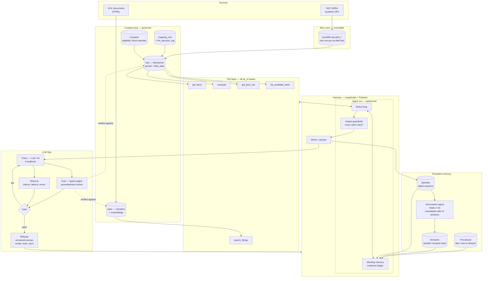
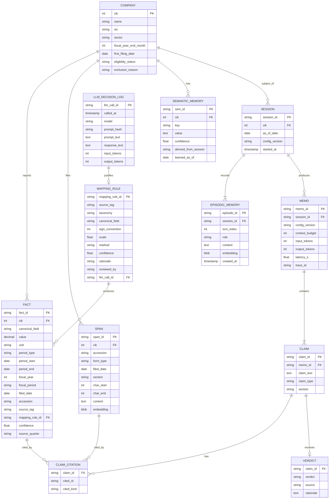
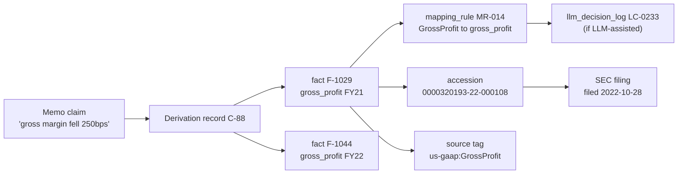
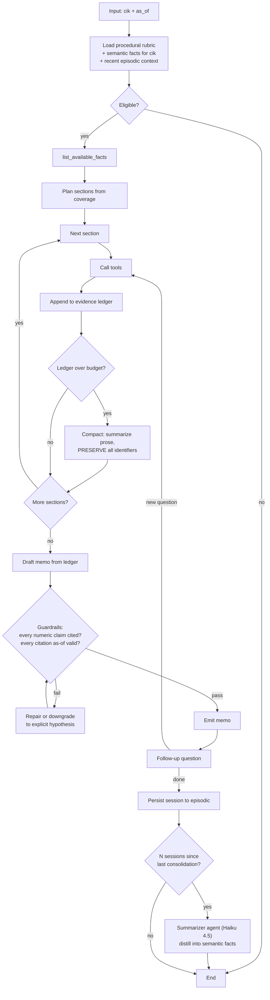
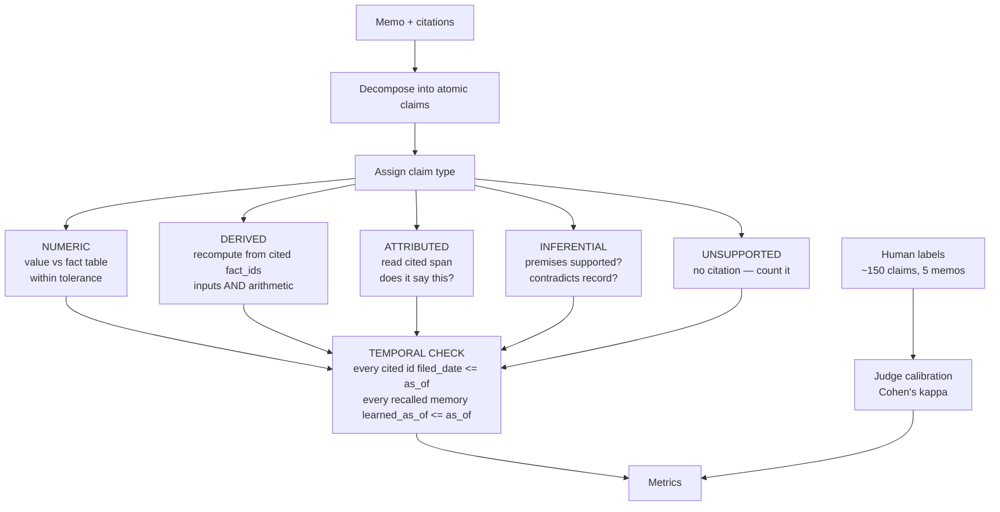
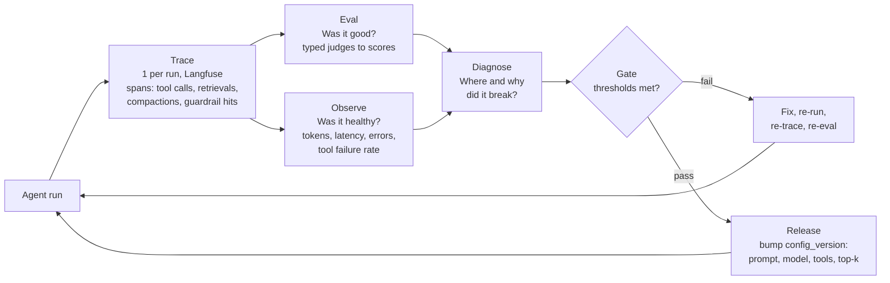

# Design: Point-in-Time SEC Fact Store + Cited Diligence Agent

**Date:** 2026-08-18
**Status:** Draft for review (rev 2 — adds memory taxonomy, harness, and LLM Ops)
**Hard deadline:** first week of September 2026
**Soft milestone:** Tuesday 2026-08-25

---

## 1. Thesis

> **Can you trust an AI financial analyst?** Build a governed, point-in-time data foundation over SEC filings, put a citing agent on top of it, and measure how often it fabricates — including a leakage test most systems would fail.

Every component earns its place under that sentence. Nothing is included for keyword coverage alone.

The differentiator is **the as-of-date constraint**: the agent answers about a company *as of a chosen date*, and can only see facts and filings published on or before that date. Not period-dated — publication-dated. This is enforced in the data layer, not by prompt instruction.

That single constraint is what turns generic components into specific ones:

| Generic | What it becomes here |
|---|---|
| RAG | Point-in-time retrieval — filtered by publication date, not just relevance |
| Working memory | An evidence ledger of immutable fact IDs that survives compaction |
| Episodic memory | Conclusions stamped with the as-of date they were formed under |
| Tools | Deterministic computation over fact IDs; the model never does arithmetic |
| Eval | Groundedness **plus a temporal leakage rate** — a metric only this store can produce |
| LLM Ops | An eval gate that blocks release when groundedness regresses |

### Why this matters commercially

Financial services is blocked on LLM deployment not by capability but by **provable groundedness**. A model that invents a number is a liability event. Separately, quantitative finance has a long-standing, expensive problem — look-ahead bias from restated and backfilled fundamentals — that vendors charge substantial sums to solve (Compustat Point-in-Time and similar). This project builds a free version of that foundation from SEC bulk data and uses it to make agent groundedness measurable and monitorable.

### Design principle for a compressed timeline

**Design the whole system now; build in priority order; instrument from day one.** Schemas and interfaces for every component are specified here. Construction is staged (§12). Tracing is built during the agent, not retrofitted after — retrofitting observability costs roughly double.

---

## 2. Scope

### In

- Bitemporal fact store from SEC DERA quarterly datasets
- Canonical schema (10 fields) + auditable mapping layer
- Narrative store (10-K sections) for ~10 companies
- Tool layer with deterministic computation, as-of enforced in SQL
- Single-company memo agent on a LangGraph harness, plus multi-turn follow-ups
- Three-tier memory: procedural, semantic, episodic, with cross-session consolidation
- Output guardrails on the reply path
- Claim-typed groundedness evaluation with human calibration
- LLM Ops: per-run tracing, health observation, eval gate, versioned release
- Governance artifacts: data dictionary, ERD, lineage map, universe definition, model card

### Out (deliberately)

| Excluded | Reason |
|---|---|
| Architecture ablation (single-shot vs. ReAct vs. plan-critique) | Traded for LLM Ops — answers an academic question where LLM Ops answers the employer's question |
| Head-to-head two-company memos | Halves eval sample; comparison handled via follow-ups |
| Forecasting benchmark (models, DM tests, SHAP) | Reduced to a single leakage demonstration |
| Foundation forecasters (Chronos/TimesFM/Moirai) | Out-of-distribution on 40-point quarterly series |
| Neural time-series zoo | Would not beat gradient boosting on this panel |
| Azure Data Lake / Synapse / Container Apps hosting | Deferred; see §14 open decisions |
| dbt transform layer | Stage 3, optional |
| Web UI | CLI/notebook only; a UI adds nothing the eval can see |
| Full SR 11-7 validation package | Reduced to a model card + the LLM Ops gate |
| Price / market data | EDGAR has none; adding a source is a separate decision |

---

## 3. Architecture



---

## 4. Data layer

### 4.1 Why DERA rather than the companyfacts API

Each DERA quarterly ZIP is **already a snapshot of what was on file at that moment**. Stack ~28 quarters, stamp each row with the quarter's publication date, and the bitemporal property falls out with almost no extra engineering. The `companyfacts` API would require reconstructing the same thing from `filed` timestamps, and — pending verification (§14) — appears to drop dimensional facts entirely.

**Verification task before implementation:** confirm current DERA file layout, column names, rate limits, and whether segment-dimensional facts are retained.

### 4.2 Two distinct time dimensions

The core of the design, and the most common place to introduce silent bugs.

| Dimension | Meaning | Column |
|---|---|---|
| **Valid time** | The period the fact describes | `period_start` / `period_end` |
| **Transaction time** | When the fact became publicly knowable | `filed_date` |

Two separate phenomena make transaction time necessary:

1. **Reporting lag.** A quarter ends 03-31; the 10-Q is filed ~05-10. For six weeks the number does not exist publicly. Guaranteed large; affects every company.
2. **Restatement.** A figure reported in April is revised in November. Most databases silently overwrite. Less frequent; magnitude is an empirical question we measure.

**Restatements are appended, never overwritten.**

```sql
-- the value that was knowable on :as_of, for one company/field/period
SELECT * FROM fact f
WHERE f.cik = :cik
  AND f.canonical_field = :field
  AND f.period_end = :period_end
  AND f.filed_date <= :as_of
QUALIFY ROW_NUMBER() OVER (
  -- A figure is identified by its full period AND unit, not by period_end
  -- alone. Every 10-Q reports a 3-month and a year-to-date figure ending
  -- the same day; a filer may report the same figure in two currencies.
  PARTITION BY f.cik, f.canonical_field, f.period_start,
               f.period_end, f.period_type, f.unit
  ORDER BY f.filed_date DESC, f.accession DESC
) = 1;
```

### 4.3 Entity-relationship model



Procedural memory is **files on disk, version-controlled** — not a table. That is the point of it (§7.4).

### 4.4 Canonical schema — v1 fields

| Field | Type | Notes |
|---|---|---|
| `revenue` | duration | Most tag-fragmented field; primary mapping test case |
| `cost_of_revenue` | duration | Often absent → gross margin uncomputable |
| `gross_profit` | duration | Derived if COGS present |
| `operating_income` | duration | |
| `net_income` | duration | |
| `total_assets` | instant | |
| `total_liabilities` | instant | |
| `stockholders_equity` | instant | |
| `operating_cash_flow` | duration | |
| `capex` | duration | Sign convention varies — must normalize |

**Period type is enforced.** Duration and instant facts are never mixed in a computation; `compute` rejects it.

### 4.5 Mapping layer

Three tiers, in order:

1. **Deterministic rules.** Curated table from standard `us-gaap` tags to canonical fields, with sign convention and scale. Covers the large majority of large filers.
2. **Structural resolution.** Where multiple candidate tags exist for one company-period: prefer the most specific, prefer the tag used in the primary statement per `pre.txt`, sum segment tags only when the total is absent.
3. **LLM-assisted classification of the tail.** For unmapped tags, retrieve the GAAP taxonomy definition and the company's own label, ask whether it represents the canonical concept, emit a confidence. Below threshold → human review queue.

**Every mapping decision is logged and reproducible.** LLM calls write to `llm_decision_log` with exact prompt, response, model ID, and token counts. `mapping_rule` rows carry `method`, `confidence`, `rationale`, `reviewed_by`.

### 4.6 Missing-value taxonomy

Missing data is reported, never silently dropped. But "not reported" is four different statements, and conflating them produces false claims about real companies.

| Status | Meaning | Memo language |
|---|---|---|
| `NOT_DISCLOSED` | Every tag in the filing checked; concept genuinely absent | "Company X does not separately disclose cost of goods sold." |
| `NOT_APPLICABLE` | Meaningless for this business type | Section suppressed with a one-line note |
| `NOT_YET_FILED` | Exists today; was not public as of the cutoff | "Not included — first filed 2023-03-14, after the as-of date." |
| `UNMAPPED` | A plausibly related tag exists; no rule covers it | "Not available in this dataset." |
| `AMBIGUOUS` | Candidate tags disagree; unresolved | "Not available in this dataset." |

`NOT_DISCLOSED` is a claim about the company. `UNMAPPED` is a claim about us. **Never emit the first when the second is true.**

**This yields the external validation the mapping layer otherwise lacks.** Each `NOT_DISCLOSED` is a testable prediction. Sample ~40, open the filings, check. The result is a measured **mapping recall rate** — a reportable number about our own system's incompleteness.

### 4.7 Universe definition

**Fact universe — 3,000–5,000 companies.** Bulk data arrives whole-market; loading 5,000 costs the same as loading 100. Breadth is required because sector medians from small samples are noise.

**Memo universe — ~10 companies.** Narrative extraction is the fiddliest engineering in the project and each memo consumes annotation attention. Reduced from 20 in rev 1 to fund LLM Ops.

Inclusion criteria (documented, with removal counts per step):

| Rule | Rationale |
|---|---|
| Exclude SIC 6000–6799 (banks, insurers, REITs) | Structurally different statements; no gross profit, inverted balance sheet, meaningless working capital |
| Exclude utilities | Regulated capital structure; different metric set |
| Exclude foreign private issuers (20-F filers) | Different form structure |
| Require ≥ 12 quarters of filing history | Trend sections need history |
| Require ≥ 5 of 10 canonical fields computable | Below this the memo is mostly stubs |

**Memo set composition:** ~10 companies across 4–5 non-financial sectors — mostly clean cases, 2–3 known-hard ones. Hard cases are **selected empirically from the bitemporal store** (most restatements, largest revisions, longest filing lag), not by intuition. Enables reporting performance by difficulty tier rather than a single average.

**Known bias, documented not solved:** the universe is reconstructed from companies filing today, so delisted and acquired companies are absent. This is survivorship bias. Point-in-time index reconstruction is out of scope; the bias is stated explicitly in the writeup and model card.

### 4.8 Fiscal calendar alignment

Nike's fiscal year ends in May; Foot Locker's in late January. "FY2022" covers substantially different stretches of real time. Comparing them naively produces arithmetically correct, analytically wrong results.

`fact` carries both fiscal labels (`fiscal_year`, `fiscal_period`) and true calendar boundaries (`period_start`, `period_end`). **Within-company** comparisons align on fiscal period. **Cross-company** comparisons — including every sector median — align on calendar time. Enforced in `get_peer_set` and `compute`, not left to the agent.

### 4.9 Narrative store

- **10-Ks only**, ~4 years, ~10 companies → ~40 documents.
- Sections: Item 1 (business), Item 1A (risk factors), Item 7 (MD&A).
- Chunked with character offsets preserved, so a `span_id` resolves to an exact range in an exact document.
- Hybrid retrieval (BM25 + embeddings), filtered by `filed_date <= as_of`.

**Risk:** section splitting from filing HTML is genuinely fiddly. Timeboxed — see §13.

---

## 5. Lineage



Generated from foreign keys, not hand-drawn.

---

## 6. Tool layer

All tools take `as_of` and enforce it in SQL. The agent cannot opt out. Schemas defined with Pydantic.

```python
get_facts(cik, fields: list[str], period_start, period_end, as_of) -> list[Fact]
    # Missing values return a status from the §4.6 taxonomy, never silence.

search_filings(cik, query, as_of, sections=None, k=8) -> list[Span]

compute(expression: str, inputs: dict[str, str]) -> Computation
    # inputs maps variable names to fact_ids.
    # Returns value + derivation_id + full substitution record.
    # Rejects duration/instant mixing and cross-fiscal-calendar comparison.

get_peer_set(cik, as_of, min_peers=10) -> PeerSet
    # SIC-based, calendar-aligned, selection rule recorded.

list_available_facts(cik, as_of) -> CoverageMap
    # Which canonical fields exist for which periods, with status codes.
```

### Two load-bearing design decisions

**The model does no arithmetic.** Every growth rate, margin, delta, and CAGR goes through `compute` over fact IDs, returning a derivation record. Eliminates an entire hallucination class and makes every number independently recomputable.

**`list_available_facts` makes refusal reachable.** Most RAG systems fabricate when retrieval fails because "I don't have this" is not an available action. An explicit coverage map turns refusal into measurable behavior rather than a failure mode.

---

## 7. Agent and memory

Harness: **LangGraph** for the stateful loop and checkpointing, **Pydantic** for tool schemas and structured outputs.



### 7.1 Working memory — the evidence ledger

Ephemeral, lives only for the run. Not conversation history — a typed artifact. Each entry: the identifier retrieved (`fact_id` / `span_id` / `derivation_id`), what it establishes, and which memo section it serves. The memo is written **from the ledger**, which is what makes post-hoc auditing possible.

### 7.2 Compaction — one inviolable rule

**Compress prose; never compress identifiers.** When the ledger exceeds budget, findings are summarized but every `fact_id` and `span_id` survives verbatim. A compaction that drops a citation is a bug, not a tradeoff, and there is a unit test for it.

### 7.3 Output guardrails

A deterministic check on the reply path, before emission:

- Every numeric or derived claim carries at least one citation
- Every cited `fact_id` / `span_id` exists and has `filed_date <= as_of`
- Every derived claim's arithmetic recomputes from its cited inputs
- Claims failing repair are **downgraded to explicit hypotheses**, not deleted silently

Guardrail rejections are logged. Rejection rate is itself a reported metric — it measures how often the raw model would have shipped an uncited claim.

### 7.4 Three-tier persistent memory

| Tier | Contents | Store | Retrieval |
|---|---|---|---|
| **Procedural** | How to analyze: memo section rubrics, metric definitions, which metrics apply to which business types, refusal policy | Version-controlled Markdown files | Loaded by section |
| **Semantic** | Durable facts about a company: fiscal calendar, segment structure, known tag idiosyncrasies, disclosure habits | DuckDB + embeddings | Top-k on cik + query |
| **Episodic** | Dated events: past sessions, prior conclusions, follow-up threads | DuckDB + embeddings | Relevance (vector) + recency (SQL) |

**Episodic memory is dated, and that is the whole project.** A conclusion formed under a 2023 cutoff is a different object from one formed under a 2025 cutoff. `SEMANTIC_MEMORY.learned_as_of` and `SESSION.as_of_date` carry that, and memory retrieval respects it: a memo run at as-of date D must not surface a remembered conclusion formed at a later date. **This is a second temporal leakage surface, and the eval tests it.**

### 7.5 Consolidation

Sessions are appended to episodic memory as they complete. **Only after N new sessions** does a summarizer agent — running on `claude-haiku-4-5`, deliberately cheaper than the main agent — distill episodic content into durable semantic facts.

Consolidation is asynchronous and batched: it never blocks a run, and running it per-session would be both expensive and noisy. Measurable outcome: tokens consumed on the third memo for a company versus the first.

### 7.6 Follow-up questions

Multi-turn is what makes memory load-bearing rather than decorative. Without it, "memory" is a within-run scratchpad. With it, sessions grow, compaction runs, and citation preservation becomes testable.

Follow-ups inherit the same `as_of`. They are scored by the same harness, enabling: **does groundedness degrade over a long session?**

Interface is **CLI / notebook**. No web UI.

### 7.7 Memo template — 11 sections

| # | Section | Primary source |
|---|---|---|
| 1 | Business description | Item 1 spans |
| 2 | Growth — trend, acceleration, seasonality | facts + compute |
| 3 | Profitability — margin stack, where pressure sits | facts + compute |
| 4 | Cash quality — net income vs. OCF divergence, FCF conversion | facts + compute |
| 5 | Capital intensity — capex/revenue, asset turnover | facts + compute + peers |
| 6 | Working capital — days inventory/receivable/payable | facts + compute |
| 7 | Balance sheet and leverage | facts + compute |
| 8 | Peer positioning | peer set, calendar-aligned |
| 9 | Management's explanation + newly-added risk factors | Item 7 / Item 1A spans |
| 10 | **Data reliability flags** — restatements, revision magnitude, filing lag | bitemporal store |
| 11 | **What could not be answered** — with status codes | coverage map |

Section 10 is unavailable to any system without a bitemporal store. Section 11 is the honesty surface — it proves the system fails loudly.

**Value-creation hypotheses** are emitted separately and explicitly labeled ("Gross margin sits 800 bps below peer median at comparable scale, suggesting a pricing or COGS disadvantage. *Hypothesis, not established by the data.*"). Scored as inferential claims (§8.1).

---

## 8. Evaluation harness



### 8.1 Claim taxonomy

| Type | Example | Verification |
|---|---|---|
| **Numeric** | "Revenue was $2.1B in Q3 FY23" | Value matches `fact` within tolerance; `fact_id` exists |
| **Derived** | "Gross margin fell 240 bps YoY" | Recompute from cited `fact_id`s — validates inputs *and* arithmetic |
| **Attributed** | "Management cited freight costs" | Cited span actually supports the attribution |
| **Inferential** | "This suggests weakening pricing power" | Not true/false. Premises supported? Contradicts record? |
| **Unsupported** | Any assertion with no citation | Counted. Headline metric. |

### 8.2 Metrics

- Unsupported-claim rate, overall and by type
- Citation precision — does cited evidence actually support the claim
- Citation coverage — fraction of assertions carrying any citation
- Contradiction rate — claims conflicting with the fact store
- **Temporal leakage rate** — claims citing evidence, or recalling memory, with a date after `as_of`
- Guardrail rejection rate — how often the raw model would have shipped an uncited claim
- Section completion rate — content vs. status code, per section
- Cost and latency per memo
- Refusal vs. fabrication rate on the adversarial set

### 8.3 Judge calibration — protected

~150 claims across 5 memos hand-labeled by the author; agreement with the automated judge reported as Cohen's kappa. **Without this the eval measures nothing.** It is the first thing that feels skippable under deadline pressure and is explicitly reserved in §12.

Judge runs on `claude-sonnet-5`; memo generation on `claude-opus-5`. Different models for generation and judging, deliberately.

### 8.4 Adversarial set

~30 questions engineered to induce fabrication: a metric the company doesn't report, a period before it was public, a segment breakdown that doesn't exist, a figure filed after the cutoff. Measures refusal versus invention — the compliance question stated directly.

---

## 9. LLM Ops

The evaluation harness produces scores. LLM Ops turns those scores into a **gate**.



### 9.1 Tracing

One trace per run, emitted **while the agent is being built, not retrofitted**. Spans cover tool calls, retrievals, compaction events, guardrail rejections, and memory reads. `MEMO.trace_id` links every generated memo to its trace.

Langfuse, self-hosted via Docker — open source, free, and the trace views make good writeup figures.

### 9.2 Versioned configuration

Everything that changes agent behavior is versioned as one object: system prompt, model ID, tool set, retrieval `k`, context budget, compaction threshold. `SESSION.config_version` and `MEMO.config_version` record which version produced which output, so any metric change is attributable to a specific config change.

### 9.3 The gate

A regression suite runs the fixed memo set against a candidate config and blocks release if:

| Threshold | Initial value |
|---|---|
| Unsupported-claim rate | must not regress vs. current release |
| Temporal leakage rate | **must be zero** — hard fail |
| Guardrail rejection rate | must not regress |
| Cost per memo | must not regress by more than 25% |

Thresholds are documented and versioned alongside the config. This is the model-risk story in operational form: no change ships without passing evaluation.

**CI platform deferred** — GitHub Actions or Azure DevOps. The gate logic is platform-independent; see §14.

---

## 10. Governance artifacts

Produced as first-class outputs, mostly generated rather than hand-written:

| Artifact | Source |
|---|---|
| Data dictionary | Generated from schema + field descriptions |
| ERD | §4.3, maintained in mermaid |
| Lineage map | §5, generated from foreign keys |
| Universe definition | §4.7, with removal counts per rule |
| Data quality test suite | pytest + documented thresholds |
| Mapping recall report | §4.6 sampling result |
| Config version history | §9.2, with the metric delta per version |
| Model card | Intended use, data, metrics, limitations, known biases |

---

## 11. Repository structure

```
edgar-diligence/
├── README.md
├── pyproject.toml
├── Makefile                      # make ingest / build / memo / eval / gate
├── docs/
│   ├── superpowers/specs/        # this document
│   ├── data-dictionary.md
│   ├── erd.md
│   ├── lineage.md
│   ├── universe-definition.md
│   ├── model-card.md
│   └── writeup/
├── config/
│   └── versions/                 # versioned agent configs (§9.2)
├── prompts/                      # procedural memory — rubrics, section specs
├── src/
│   ├── ingest/                   # DERA download, unpack, load
│   ├── bitemporal/               # fact build, as-of views, restatement analysis
│   ├── mapping/                  # canonical schema, rules, llm_assisted, review CLI
│   ├── narrative/                # fetch, section split, chunk, index
│   ├── tools/                    # the five agent tools (Pydantic schemas)
│   ├── agent/                    # LangGraph loop, ledger, compaction, guardrails
│   ├── memory/                   # procedural, semantic, episodic, consolidation
│   ├── eval/                     # decompose, judges, metrics, calibration
│   ├── ops/                      # tracing, gate, release
│   └── common/                   # db, config, logging
├── tests/
├── notebooks/
├── data/                         # gitignored
└── .ci/                          # platform decided later (§14)
```

---

## 12. Milestones

**Hours are not the binding constraint.** Stages are **delivery order**, not time boxes: finish and verify each before starting the next, and take Stage 3 as far as the September deadline allows. Hour figures below are relative effort estimates for sequencing only.

The real constraint is **Claude usage limits** (§14). That shapes *how* the work is executed more than *how much* is attempted — see §12.1.

### Stage 1 — by Tue 2026-08-25 (~38 h) · independently shippable

| # | Task | Hours |
|---|---|---|
| 1.1 | Verify DERA layout, rate limits, dimensional-fact availability | 3 |
| 1.2 | Bulk ingest → DuckDB raw zone, 2019–2026 | 8 |
| 1.3 | Bitemporal fact table + as-of query layer + tests | 8 |
| 1.4 | Canonical schema + deterministic mapping + coverage report | 10 |
| 1.5 | Restatement / reporting-lag measurement | 6 |
| 1.6 | Universe definition + eligibility screen | 3 |

If everything after this collapses, Stage 1 alone is a complete artifact: *a point-in-time SEC fundamentals store and a measurement of what backfilled data does to evaluation.*

### Stage 2 — by 2026-09-04 (~59 h) · thin end-to-end slice

The deadline deliverable. One agent, instrumented, with a measured and human-calibrated eval.

| # | Task | Hours |
|---|---|---|
| 2.1 | Tool layer, Pydantic schemas, as-of enforced | 6 |
| 2.2 | Narrative extraction, sectioning, indexing (~10 companies) | 7 |
| 2.3 | Agent on LangGraph: loop, evidence ledger, compaction, guardrails | 12 |
| 2.4 | Tracing instrumented during build (Langfuse) | 4 |
| 2.5 | Eval harness: decomposition, typed judges, metrics | 12 |
| 2.6 | Human calibration (~150 claims) — **reserved** | 6 |
| 2.7 | Writeup — **reserved** | 12 |

### Stage 3 — after Stage 2 (~48 h, or ~40 h excluding optional dbt) · depth

Designed now, built after Stage 2 verifies. Ordered by value. May partially land before the September deadline.

| # | Task | Hours |
|---|---|---|
| 3.1 | Three-tier memory + cross-session consolidation | 10 |
| 3.2 | Eval gate + versioned release pipeline | 7 |
| 3.3 | LLM-assisted mapping tail + audit log | 8 |
| 3.4 | Governance artifacts + model card | 5 |
| 3.5 | Adversarial set | 4 |
| 3.6 | CI pipeline (platform per §14) | 6 |
| 3.7 | dbt transform layer — optional | 8 |

**Why staged this way:** memory and the gate are the most architecturally interesting additions, but the project has no story at all without a working agent and a credible eval. Stage 2 buys the story; Stage 3 buys the depth. Schemas and interfaces for Stage 3 are specified now so nothing needs retrofitting — with tracing (2.4) pulled forward, because retrofitting observability costs roughly double.

### 12.1 Working under usage limits

The constraint is Claude usage, not calendar hours. This shapes execution:

- **Every task in the implementation plan is self-contained** — its own acceptance criteria and test, executable in a fresh session without reloading the whole repository.
- **Tests are written before implementation.** Debugging blind is the most token-expensive failure mode there is.
- **Schemas and interfaces are fixed in this document**, so implementation sessions do not re-litigate design.
- **Exploratory data work happens in notebooks and is summarized to disk**, so findings survive without re-deriving them.
- **Model tiering inside the project**: `claude-opus-5` for memo generation, `claude-sonnet-5` for judging, `claude-haiku-4-5` for consolidation.

### Never cut

- Bitemporal fact table and as-of enforcement
- Human calibration of the judge (§8.3)
- Memo section 11 and the missing-value taxonomy (§4.6)
- The writeup

---

## 13. Cost estimate

Rates as of 2026-06-24. Sonnet 5 is at introductory pricing ($2/$10 per MTok) **through 2026-08-31**, covering this window.

| Workload | Model | Estimate |
|---|---|---|
| LLM-assisted tag mapping (~2,000 tags, Stage 3) | `claude-opus-5` | ~$25 |
| Memo generation (10 companies, with iteration) | `claude-opus-5` | ~$60–100 |
| Claim judging (~600 claims) | `claude-sonnet-5` | ~$10 |
| Memory consolidation | `claude-haiku-4-5` | ~$5 |
| Embeddings for narrative index | local model | ~$0 |
| **Total including development iteration** | | **~$120–200** |

Langfuse self-hosted: $0. Azure, if chosen in §14: ~$20–30/month.

---

## 14. Risks and open decisions

| Risk | Severity | Mitigation |
|---|---|---|
| **Claude usage limits** | High | The binding constraint. Mitigated by §12.1: self-contained tasks, tests-first, fixed interfaces, findings persisted to disk. Stage boundaries are natural stopping points if limits are hit mid-project. |
| **Narrative section extraction from filing HTML** | High | Timeboxed to 7 h. Fallback: paragraph chunking without section labels. Must not consume Stage 1. |
| **Human calibration gets squeezed** | High | Reserved in Stage 2, not left to the end. |
| **LangGraph learning curve** | Medium | First use of the framework. Fallback: hand-rolled loop with the same interfaces; the design does not depend on LangGraph specifics. |
| **DERA layout differs from assumption** | Medium | Task 1.1 verifies before anything is built on it. |
| **Segment-dimensional facts unavailable** | Medium | Verified in 1.1. If unavailable, segment analysis drops; sections 2–8 do not depend on it. |
| **Mapping validation is partial** | Medium | §4.6 sampling gives a measured recall rate. External reconciliation stated as future work. |
| **Restatement rate turns out small** | Low | The bitemporal story rests on reporting lag, which is guaranteed large. A small restatement rate is a rigorous negative result, not a failure. |

### Open decisions

1. **CI platform — GitHub Actions or Azure DevOps.** Deferred by agreement. Gate logic is platform-independent, so this can be decided at Stage 3 without rework. Azure carries the keyword the target roles screen for; GitHub Actions is faster and free.
2. **Add price data?** Currently pure-EDGAR. Adding a free source enriches features but complicates provenance. Default: no.
3. **Git repository** — not yet initialized. Recommend a fresh `edgar-diligence/` repo rather than initializing in this directory, which also holds unrelated files.
4. **Public repository?** Recommend: public, and do not name a target employer.

---

## 15. Success criteria

**Stage 1 succeeds if:**
- As-of queries return provably correct point-in-time values, with tests
- Restatement frequency and magnitude are measured and reported
- Mapping coverage is measured, not asserted

**Stage 2 succeeds if:**
- Every numeric claim in a memo resolves to a `fact_id` that resolves to an accession number
- Unsupported-claim rate is measured with a human-calibrated judge, kappa reported
- Temporal leakage rate is measured and is approximately zero — and if it is not, that is reported honestly
- Every run has a trace, and every memo links to it

**Stage 3 succeeds if:**
- A config change that regresses groundedness is blocked by the gate before release
- The third memo for a company costs measurably fewer tokens than the first
